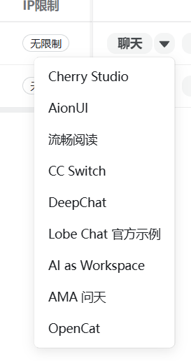
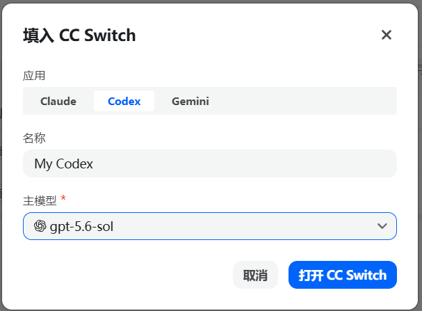
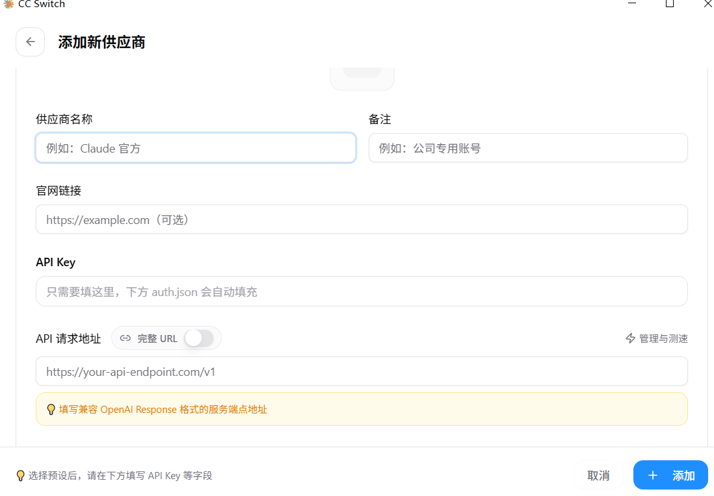

# 工作流实战（一）：Windows 端 Codex Win + cc-switch 的高效开发工作流探索

在探索 AI 辅助开发的过程中，很多初学者常常面临“网络不稳定”、“模型 API 无法直接连通”、“终端命令工具配置门槛高”等实际痛点。

在我的实际工作与项目探索中，最初跑通并长期稳定运行的一套高产出工作流，正是基于 Windows 桌面生态构建的：以微软商店开箱即用的 **Codex Win** 作为核心代码智能体，配合 Windows 平台的 **cc-switch** 进行多端点与供应商一键切换。

这套方案兼顾了图形化操作的直观友好、多服务商模型自由切换的灵活性，以及中转站一键导入的便捷体验。本篇将详细记录这套工作流的环境准备、中转站联动配置与日常开发实录。

---

## 一、架构设计：Codex Win 与 cc-switch 的协同分工

在 Windows 工作台上，这套工作流由两大核心工具组成：

```text
┌────────────────────────────────────────────────────────┐
│ 1. 凭证与端点中枢：cc-switch (Windows 桌面端)          │
│    - 托管多个供应商 (官方直连 / 自建中转 / New API 节点) │
│    - 支持中转站一键唤醒导入与手动配置，快速派发 Base URL│
└──────────────────────────┬─────────────────────────────┘
                           │ 托管与路由中转
                           ▼
┌────────────────────────────────────────────────────────┐
│ 2. 代码执行智能体：Codex Win (微软应用商店)            │
│    - 原生适配 Windows 系统环境与项目目录               │
│    - 可视化项目管理、代码分析、Diff 审查与执行         │
└────────────────────────────────────────────────────────┘
```

- **Codex Win**：微软官方应用商店分发的 Windows 桌面级代码生成与调试工具，直接读取本地项目目录，支持直观的可视化代码审查与本地环境执行；
- **cc-switch**：专注于 Coding Agent 的桌面端多端点切换器。开发中不同任务对模型能力的要求不同（写简单测试与日常注释用便宜模型，核心架构重构用高阶大模型），通过 cc-switch 可以随时切换接入点，彻底告别在系统环境变量或配置文件里反复手动改 Key 的麻烦。

---

## 二、工具安装与环境就绪

两款工具在 Windows 平台均提供了成熟的图形化安装渠道，无需手动编译。

### 1. Codex Win 安装

Codex Win 已上架 Windows 官方应用分发渠道：

1. 打开 Windows 系统的 **Microsoft Store（微软商店）**；
2. 在顶部搜索框输入 `Codex`；
3. 找到官方应用，点击「获取」或「安装」即可自动完成部署；
4. 启动后登录或进入初始化设置界面。

### 2. cc-switch Windows 版安装

访问官方中文下载页面获取最新 Windows 安装程序：

- **官方下载地址**：[https://ccswitch.io/zh/download](https://ccswitch.io/zh/download)

下载适用于 Windows 的安装包后，按向导提示点击安装。启动后即可进入可视化配置管理面板。

---

## 三、cc-switch 端点配置与 Codex Win 联动

配置 API 端点通常有两种途径：借助现代开源中转站（如 **New API**、**sub2api**）提供的**协议一键导入**，或者通过 cc-switch 界面进行**手动配置**。

### 1. 中转站自动化配置：以 New API 一键导入为例

目前主流的开源 AI API 管理分发系统（如 New API、sub2api）均原生集成了常用客户端的生态接入。系统通过注册专有协议（URL Scheme），能够直接把 Base URL、API Key 与可用模型列表推送到桌面客户端，极大降低了手动配置成本。

具体操作流转链路如下：

#### 步骤 1：在令牌列表中选择客户端
登录 New API 控制台，点击左侧导航栏的「令牌管理」。在目标令牌所在行的操作区域，点击「聊天」下拉菜单，在弹出的客户端列表中直接选中 **「CC Switch」**：



#### 步骤 2：设置关联应用与主模型
在弹出的「填入 CC Switch」对话框中：
- **应用**：切换至 **`Codex`**（系统默认支持 Claude、Codex 与 Gemini）；
- **名称**：填写便于记忆的节点名称（例如 `My Codex` 或中转站名称）；
- **主模型**：从下拉菜单中选中需要绑定的主力模型（如 `gpt-5.6-sol` 等）：



#### 步骤 3：一键唤醒并确认导入
点击对话框右下角蓝色的 **「打开 CC Switch」** 按钮。浏览器会自动调用系统协议唤醒本地运行的 cc-switch 桌面客户端，并在弹出的确认界面中点击 **「导入」**，该中转站节点即可瞬间完成配置添加。

::: tip 协议联动的工程优势
传统手动复制黏贴极易出现三类人为失误：漏掉末尾的 `/v1` 路由、复制 Key 时多带了首尾空格，或是把模型名称字母敲错。使用 New API 的一键导入机制，所有配置由中转站直接组装标准数据包推送到 cc-switch，彻底规避了此类排错成本。
:::

### 2. 手动配置方式

如果使用的是没有提供一键导入按钮的独立中转站或私有代理节点，可以在 cc-switch 中通过可视化向导手动录入：

#### 操作步骤：
1. 打开 cc-switch 客户端，在窗口顶部选择 **OpenAI 的图标**；
2. 点击右上方的 **加号（`+`）** 进入添加供应商界面；
3. 在弹出的界面中向下滚动滚轮，找到 **Codex 供应商 - 自定义配置** 区域；
4. 依次填写以下核心参数：
   - **供应商名称**：自定义标识（如 `公司专用中转` 或 `个人代理`）；
   - **API Key**：填入对应的接口访问密钥（系统会自动填充下方的认证结构）；
   - **API 请求地址**：填入服务商提供的端点 URL（**务必在地址末尾加上 `/v1`**，例如 `https://your-api-endpoint.com/v1`）；
5. 点击右下角蓝色的 **「+ 添加」** 按钮保存生效。



::: warning 手动填写注意：必须包含 /v1
手动配置任何自建中转 API 或第三方代理服务时，在请求域名后面**必须加上 `/v1` 路径**（例如 `https://your-api-endpoint.com/v1`）。缺少该层级路由会导致后端网关无法匹配控制器并直接返回 404 Not Found。
:::

### 3. 将配置应用至 Codex Win

在 cc-switch 供应商列表中，点击需要激活的节点将其设为当前生效。随后打开 Codex Win，应用会自动读取并对齐当前激活的模型与网络路由。

日常开发需要切换高低算力时，只需在 Windows 任务栏右下角唤出 cc-switch 切换，Codex Win 即可即时生效，无需重启重配。

---

## 四、Windows 端真实日常开发流演练

当底座搭建完毕后，日常工作流便顺畅流转起来：

```text
「任务到来」
    │
    ▼
「通过 cc-switch 选择对应模型节点」
  ├─ 复杂重构 / 架构设计 → 激活高性能主力节点
  └─ 编写单测 / 格式校验 → 激活低成本经济型节点
    │
    ▼
「在 Codex Win 中打开本地代码工作区」
    │
    ▼
「输入确定性自然语言 Prompt」
    │
    ▼
「Codex Win 扫描目录结构，输出 Diff 差异比对」
    │
    ▼
「人工视觉 Review 代码并一键 Accept 应用」
```

### 1. 场景 A：零成本快速补充单元测试

1. 在 Windows 任务栏呼出 **cc-switch**，切换到经济型模型节点；
2. 打开 **Codex Win**，加载项目目录；
3. 发送指令：
   ```text
   读取 src/services/auth.ts 文件，基于其中的 hashPassword 与 verifyPassword 方法，在 tests/auth.spec.ts 中编写完整的 Vitest 测试套件，包含正确密码校验、错误密码拒绝与空值异常边界。
   ```
4. Codex Win 在左侧目录树生成对应测试文件，右侧展示 Diff 代码，点击即可一键保存写入。

### 2. 场景 B：处理复杂的业务状态机重构

1. 在 **cc-switch** 中切换至主力高算力节点；
2. 将需求交代给 Codex Win：
   ```text
   当前订单支付状态逻辑分散在 4 个文件中。请设计一个枚举类型 OrderStatus 并将状态流转封装为独立的 Service。请先列出需要修改的文件清单与接口设计，经我确认后再做修改。
   ```
3. 利用高算力节点的注意力优势，系统能够一次性精准梳理多处调用点，避免改了这头漏了那头。

---

## 五、阶段性总结：为什么我们要转到 Linux 上去？

基于 **Windows 桌面 + Codex Win + cc-switch** 的体系，是我在探索 AI 编程早期的坚实基石。它具备操作门槛低、开箱即用、一键导入中转站、可视化 Diff 清晰等优点，非常适合中小型需求与单兵快速迭代。

然而，随着工程复杂度提高，Windows 原生环境暴露出两个阻碍深入开发的硬伤：

1. **环境管理难，PowerShell (PSH) 环境不适合深度开发**：
   Windows 下的开发环境极易因路径反斜杠、全局环境变量穿透、包管理器差异等问题陷入泥潭。更关键的是，Windows 的 PowerShell（PSH）指令集与脚本生态与现代后端、容器化、开源 CLI 工具链存在天然隔阂，终端脚本和依赖配置频繁遇到跨平台语法卡点。现代高质量的开源工具生态（Docker、各类 CLI Agent、编译工具链）原生是为 POSIX/Linux 量身定制的。
2. **缺乏多智能体并发协同能力**：
   Codex Win 属于典型的“单主线 Agent”形态，无法支持多智能体并发分工（例如无法一边派一个 Agent 写接口、一边派另一个 Agent 改前端、同时由第三个 Agent 独立跑审查与测试）。

基于以上痛点，为了拥有原汁原味的统一开发底座与更强大的并发生产力，**我们必须把工作流全面转到 Linux (WSL2) 环境上去**。

下一篇，我们将正式揭秘目前我正在主力使用的进阶工作流：**基于 WSL2 的 OpenCode CLI 多智能体协同配置**，讲透如何利用 Linux 强大的终端基建与多 Agent 并发编排，打造真正的全自动软件工程生产车间。
