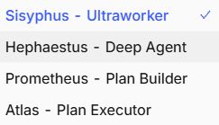

# 工作流实战（三）：Oh My OpenCode 安装、模型矩阵与内置多智能体编排实战

在前面两篇中，我们完成了 Windows 桌面端 + cc-switch 的敏捷探索，并搭建起了基于 WSL2 的原生 Linux 底座与跨系统连接。

但当项目进入复杂的全栈工程化阶段，单个模型串行编码依然会面临两大痛点：**复杂任务缺乏分工容易顾此失彼**，以及**测试报错时缺乏独立审查专家导致在同一个错误里来回打转**。

本篇我们将正式请出目前社区极客圈最炙手可热的终极增强神器——**Oh My OpenCode**。

- **官方项目仓库**：[opensoft/oh-my-opencode (GitHub)](https://github.com/opensoft/oh-my-opencode)
- **推荐视频教程**：[Oh My OpenCode 生产级配置与进阶实战指南 (YouTube)](https://youtu.be/G_Snfh2M41M?si=I-GfdVlogv7Yav7_)

本篇将一步步拆解：如何通过指令让 OpenCode 自我安装该套件、如何配置 Provider 的高级思考变体、深入理解界面自带的四大核心智能体模式，并在 `.omo` 配置文件中为各个智能体分配专属的大脑。

---

## 一、Oh My OpenCode 安装全流程

与传统复杂的手工下载解压不同，Oh My OpenCode 充分利用了 Coding Agent 的自主阅读与环境配置能力。安装过程由 OpenCode 自身在终端内自主接管完成。

### 自动化引导安装指令

在 WSL2 终端中启动 OpenCode，直接在对话框中粘贴并发送以下指令：

```bash
curl -s https://raw.githubusercontent.com/code-yeongyu/oh-my-opencode/refs/heads/master/docs/guide/installation.md
```

或者直接对 OpenCode 说：
> "请读取并执行该安装文档中的向导：curl -s https://raw.githubusercontent.com/code-yeongyu/oh-my-opencode/refs/heads/master/docs/guide/installation.md"

OpenCode 会自动拉取官方最新的安装引导说明，在后台自动完成：
1. 检查本地环境依赖并下载 `oh-my-openagent` 插件扩展；
2. 在用户家目录下初始化配置目录 `~/.omo/` 与核心模型映射文件 `omo.jsonc`；
3. 将插件自动注册进 `~/.config/opencode/opencode.jsonc`。

安装完成后，退出并重启 OpenCode 即可生效。

---

## 二、配置 opencode.jsonc：为 Provider 注入 Variants 与 Modalities

完成套件安装后，为了让各智能体能够自适应选择不同思考强度（Reasoning Effort）并解锁多模态解析能力，我们需要在 WSL2 的 `~/.config/opencode/opencode.jsonc` 中对 `provider` 节点进行深度声明。

打开并编辑配置文件：

```bash
nano ~/.config/opencode/opencode.jsonc
```

加入并完善你的 Provider 定义：

```jsonc
{
  // 1. 确保已自动挂载核心插件
  "plugin": [
    "oh-my-openagent@latest"
  ],

  "$schema": "https://opencode.ai/config.json",

  // 2. 上下文压缩优化
  "compaction": {
    "auto": true,
    "prune": false,
    "reserved": 10000
  },

  // 3. 辅助轻量小模型（用于快速提取代码元数据、执行简单总结）
  "small_model": "myprovider/gemini-3.8-flash-high",

  // 4. 服务商核心矩阵与模型能力定义
  "provider": {
    "myprovider": {
      "name": "主力服务提供商",
      "npm": "@ai-sdk/openai-compatible",

      "options": {
        // 中转站 API 接口基地址（必须带 /v1）
        "baseURL": "https://proxy.your-domain.me/v1"
      },

      "models": {
        // 模型一：Gemini 3.7 Flash（配置低/中/高三档自适应思考强度）
        "gemini-3.7-flash-high": {
          "name": "Gemini 3.7 Flash",
          "variants": {
            "低": { "reasoningEffort": "low" },
            "中": { "reasoningEffort": "medium" },
            "高": { "reasoningEffort": "high" }
          },
          // 声明支持文本、图片、PDF 多模态输入
          "modalities": {
            "input": ["text", "image", "pdf"],
            "output": ["text"]
          }
        },

        // 模型二：Gemini 3.8 Flash
        "gemini-3.8-flash-high": {
          "name": "Gemini 3.8 Flash",
          "variants": {
            "低": { "reasoningEffort": "low" },
            "中": { "reasoningEffort": "medium" },
            "高": { "reasoningEffort": "high" }
          },
          "modalities": {
            "input": ["text", "image", "pdf"],
            "output": ["text"]
          }
        },

        // 模型三：主力高智商大模型（如 GPT 或 Claude）
        "gpt-5.6-sol": {
          "name": "GPT-5.6 Sol",
          "variants": {
            "普通": { "reasoningEffort": "medium" },
            "高": { "reasoningEffort": "high" }
          },
          "modalities": {
            "input": ["text", "image", "pdf"],
            "output": ["text"]
          }
        }
      }
    }
  }
}
```

::: tip 关键属性说明
- **`variants`（思考强度变体）**：为后续智能体按需选择推理预算（低/中/高档位）提供标准选项；
- **`modalities`（多模态能力声明）**：显式开放 `image` 和 `pdf` 输入，使得 Agent 能够直接阅读设计稿与报错截屏。
:::

---

## 三、Oh My OpenCode 四大核心智能体模式全景解析

::: tip 重要架构认知
**Oh My OpenCode 已经原生内置了完整的多智能体体系与提示词工程，完全不需要、也不应该在 `opencode.jsonc` 中手动编写 `agents` 矩阵定义！**
:::

成功安装套件后，启动 OpenCode 会在界面的智能体模式下拉菜单中看到由 Oh My OpenCode 带来的四大核心模式：



这四大模式面向不同的工程开发阶段，构成了专业的分层作战矩阵：

### 1. Sisyphus - Ultraworker（终极工人 / 主控调度中枢）
- **适用场景**：日常大多数全栈开发需求（默认主力模式）。
- **工作机制**：西西弗斯（Sisyphus）是全能型的总指挥官。它不会盲目手敲代码，而是先解析用户目标，维护一份结构严谨的实时 Todo 清单；遇到独立子任务时，自动在后台并发调度子智能体（Sisyphus Junior）编写代码，并在交付前调动高智商顾问（Oracle）执行测试验证。

### 2. Hephaestus - Deep Agent（赫菲斯托斯 / 深度攻坚工匠）
- **适用场景**：复杂的底层架构重构、长周期难题攻坚、棘手的跨模块 Bug 排查。
- **工作机制**：希腊神话中的工匠之神。具备极强的主动深思能力与长程自主排错能力，专注于解决“牵一发而动全身”的代码深水区问题，能够进行端到端的深度代码自愈与多轮验证。

### 3. Prometheus - Plan Builder（普罗米修斯 / 规划蓝图师）
- **适用场景**：架构开工前、跨十几个组件的大型功能重构。
- **工作机制**：先思后行的典范。在动任何一行代码之前，它会全面扫描代码库、理清调用拓扑，输出一份完全决策完成、可验证的执行蓝图（Work Plan，保存至 `.omo/plans/`）。它专门负责把模糊的需求变为确定性的施工图纸。

### 4. Atlas - Plan Executor（阿特拉斯 / 计划执行者）
- **适用场景**：严格按既定蓝图进行工程落地。
- **工作机制**：顶天立地的执行力量。专门负责接管 Prometheus 规划好的蓝图文件，以最高确定性按部就班地逐条施工，严格遵循架构规范，彻底消灭自由发挥产生的代码幻觉。

---

## 四、配置 .omo 模型分配：为每个智能体分配专属大脑

由于 Oh My OpenCode 原生内置了上述四大模式及其下属的子 Agent（如只读审查员 Oracle、执行工人 Sisyphus Junior 等），**各个智能体与底层大模型的对应绑定，统一在 `~/.omo/omo.jsonc` 配置文件中进行管理**。

通过分配不同特性的大脑，并配置**自动降级容灾（Fallback）机制**，能让整套系统兼顾高智商、极速响应与网络稳定性。

打开并编辑 WSL2 家目录下的 `~/.omo/omo.jsonc`：

```bash
nano ~/.omo/omo.jsonc
```

### 生产级 omo.jsonc 模型分配范本

```jsonc
{
  "$schema": "https://raw.githubusercontent.com/code-yeongyu/oh-my-openagent/dev/assets/omo.schema.json",

  "[opencode]": {
    // -------------------------------------------------------------------------
    // 1. 运行时自动降级策略 (Runtime Fallback)
    // 遇到 429 限流或 500/502 上游超时报错，按配置列表自动顺延切换下一个模型
    // -------------------------------------------------------------------------
    "runtime_fallback": {
      "enabled": true,
      "retry_on_errors": [429, 500, 502, 503, 504],
      "max_fallback_attempts": 3,
      "cooldown_seconds": 60,
      "notify_on_fallback": true
    },

    // -------------------------------------------------------------------------
    // 2. 后台并发控制：防止同一时间过多并发打爆中转接口
    // -------------------------------------------------------------------------
    "background_task": {
      "defaultConcurrency": 3
    },

    // -------------------------------------------------------------------------
    // 3. 核心智能体大脑分配矩阵 (Agents)
    // -------------------------------------------------------------------------
    "agents": {
      // 1. Sisyphus（主控中枢）：分配高算力旗舰模型与高思考变体
      "sisyphus": {
        "model": "myprovider/gpt-5.6-sol",
        "variant": "高",
        "fallback_models": [
          { "model": "myprovider/gemini-3.7-flash-high", "variant": "高" }
        ]
      },

      // 2. Sisyphus Junior（执行工人）：分配响应迅速的模型与普通思考变体
      "sisyphus-junior": {
        "model": "myprovider/gemini-3.7-flash-high",
        "variant": "普通",
        "fallback_models": [
          { "model": "myprovider/gemini-3.8-flash-high", "variant": "普通" }
        ]
      },

      // 3. Hephaestus（深度攻坚工匠）：高推理深度模型
      "hephaestus": {
        "model": "myprovider/gpt-5.6-sol",
        "variant": "高",
        "fallback_models": [
          { "model": "myprovider/gemini-3.7-flash-high", "variant": "高" }
        ]
      },

      // 4. Prometheus（规划蓝图师）：逻辑推演大模型
      "prometheus": {
        "model": "myprovider/gpt-5.6-sol",
        "variant": "高"
      },

      // 5. Atlas（计划执行官）：高确定性执行大脑
      "atlas": {
        "model": "myprovider/gemini-3.7-flash-high",
        "variant": "普通"
      },

      // 6. Oracle（只读审查顾问）：严苛审查与测试回归
      "oracle": {
        "model": "myprovider/gpt-5.6-sol",
        "variant": "高",
        "fallback_models": [
          { "model": "myprovider/gemini-3.7-flash-high", "variant": "高" }
        ]
      }
    }
  }
}
```

::: tip 配置设计精髓
1. **主控与蓝图重推理**：Sisyphus、Prometheus 与 Oracle 分配高推理旗舰模型，并锁定 `variant: "高"`，保证在全局拆解和测试复核时不走偏；
2. **执行工匠重速度与确定性**：Sisyphus Junior 与 Atlas 选用轻快、并发成本低的 Flash 模型，保证大规模并发改代码时极速响应；
3. **高可用自动容灾**：每个 Agent 均配备 `fallback_models`，当遭遇第三方 API 偶发性 502 或 429 限流时，系统在毫秒级自动切换到备用模型继续执行，整个过程平滑无感。
:::

---

## 五、全套工作流实战大总结

至此，通过这三篇连贯的工作流实战指南，我们完整走过了现代 AI 辅助开发的演进全貌：

| 阶段篇章 | 核心技术拓扑 | 适用场景与工程收益 |
| :--- | :--- | :--- |
| **第一篇：桌面单兵探索** | Windows + Codex Win + cc-switch + New API | 门槛极低、直观可视化、模型一键导入，适合中小型需求快速交付 |
| **第二篇：Linux 底座打通** | WSL2 (Ubuntu 24.04) + 镜像网络 + OpenCode Desktop | 彻底摆脱 Windows 环境难、脚本不兼容的痛点，打通 C/S 跨系统连接 |
| **第三篇：多智能体车间** | Oh My OpenCode + 原生四大主模式 + `.omo` 模型分配 | 告别单兵串行，构筑起规划、攻坚、执行、质检多模式并存的全自动软件工厂 |

当你熟练驾驭这套工作流后，你不仅是代码的编写者，更是一名坐镇中枢的系统总指挥，指挥着各司其职的智能体军团，在纯净强大的 Linux 环境中高效、确定地实现每一个复杂系统的工程交付。
