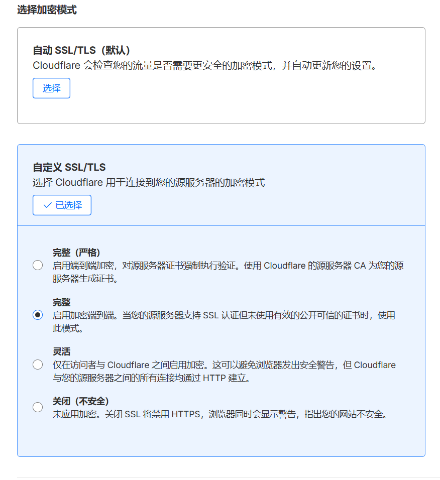
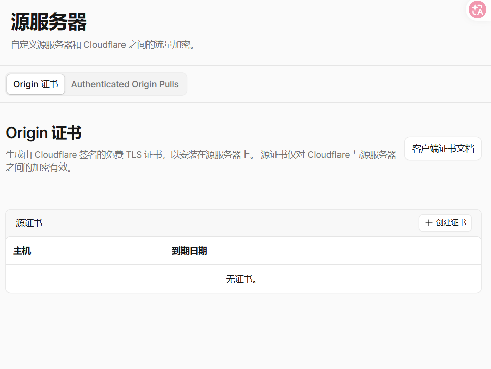

# 在 Cloudflare 创建免费 SSL 证书方法

很多个人站点在接入 Cloudflare 之后，第一步解决的是 DNS 和代理接入，第二步才会回到 HTTPS。浏览器侧是否显示安全连接，源站和 Cloudflare 之间是否已经形成完整加密链路，往往决定了这个站点是不是已经到了可长期运行的状态。

如果目标只是先把免费证书跑起来，Cloudflare 提供的能力已经足够覆盖大多数个人项目。关键点不在于“有没有证书”，而在于要分清楚 **访客到 Cloudflare** 和 **Cloudflare 到源站** 这两段连接分别怎么处理。

## 先理解 Cloudflare 里的两类 SSL

在 Cloudflare 场景里，通常会遇到两类证书：

- **Universal SSL**：这是 Cloudflare 免费提供给站点的边缘证书，主要负责浏览器到 Cloudflare 这一段 HTTPS。
- **Origin Certificate**：这是签发给源站服务器使用的证书，主要负责 Cloudflare 回源到服务器这一段 HTTPS。

如果只开了 Universal SSL，那么用户访问网站时浏览器到 Cloudflare 可以是 HTTPS，但 Cloudflare 回源时未必加密。

如果源站也配置了 Origin Certificate，并在 SSL/TLS 模式中启用 `Full (strict)`，那么整条链路会更完整。

## 在 Cloudflare 创建免费 SSL 证书的基本步骤

### 1. 确认域名已经接入 Cloudflare

先确保域名已经完成下面几件事：

- 域名 NS 已切换到 Cloudflare。
- 站点 DNS 记录已经在 Cloudflare 中可见。
- 需要开启代理的记录已经显示为橙色云朵。

如果这一步没完成，后面的免费 SSL 不会按预期生效。

### 2. 启用 Universal SSL

进入 Cloudflare 控制台后：

1. 选择目标站点。
2. 打开 `SSL/TLS`。
3. 在概览页确认 SSL 功能已启用。

对免费套餐来说，Universal SSL 通常会自动签发，不需要单独购买证书。新接入的域名一般会经历一个签发和部署过程，生效时间可能不是即时完成。


### 3. 给源站创建 Origin Certificate

如果服务器端也要走 HTTPS，可以继续在 Cloudflare 中创建源站证书：

1. 进入 `SSL/TLS` 相关证书页面。

2. 选择创建 `Origin Certificate`。
3. 填写主域名和需要覆盖的子域名，例如 `example.com` 和 `*.example.com`。
4. 生成证书和私钥。
5. 将证书和私钥保存到服务器。

这张证书不是给浏览器直接信任的，而是给 Cloudflare 回源使用，所以它的定位和普通公网 CA 证书不同。

### 4. 在服务器中配置证书

以 Nginx 为例

```nginx
# 1. 创建证书存放目录
sudo mkdir -p /etc/nginx/ssl

# 2. 保存 Cloudflare 证书和私钥
# 创建ssl_certificate 证书
sudo vim /etc/nginx/ssl/cloudflare-origin.crt
# 创建ssl_certificate_key 私钥
sudo vim /etc/nginx/ssl/cloudflare-origin.key
```

之后重载 Nginx，让 HTTPS 配置生效。
```
sudo systemctl restart nginx
```
### 5. 把 SSL 模式改为 Full (strict) - 完整（严格）

当源站证书已经正确部署后，再回到 Cloudflare：

1. 打开 `SSL/TLS` 概览。
2. 将加密模式设置为 `Full (strict)` 。

这样浏览器到 Cloudflare、Cloudflare 到源站两段都会校验证书并走 HTTPS，安全性会更完整。

## 常见问题

### 浏览器已经是 HTTPS，但源站还是 HTTP

这通常说明只是启用了 Universal SSL，还没有给源站部署证书，或者 SSL 模式仍然是 `Flexible`。

### 开启严格模式后网站报错

这通常意味着源站证书没有正确安装，或者 Nginx 站点配置加载的证书路径不对。

### 证书创建了但访问仍不稳定

需要继续检查几件事：

- DNS 记录是否代理开启。
- 源站 443 端口是否开放。
- Web 服务是否真的监听了 HTTPS。
- Cloudflare 配置是否已经完成全球边缘节点同步。

## 建议的最终配置

如果是个人网站或博客，比较稳妥的一套免费方案通常是：

- 使用 Cloudflare 免费版托管 DNS 和代理。
- 浏览器侧使用 Universal SSL。
- 源站侧使用 Cloudflare Origin Certificate。
- SSL 模式设置为 `Full (strict)`。

这样既能把 HTTPS 跑通，也能把站点入口层和源站链路一起补齐。

> 参考链接 https://www.cnblogs.com/EthanS/p/18137838