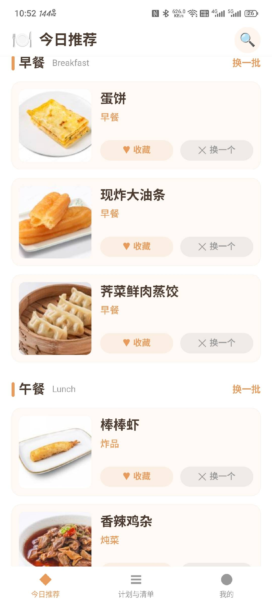
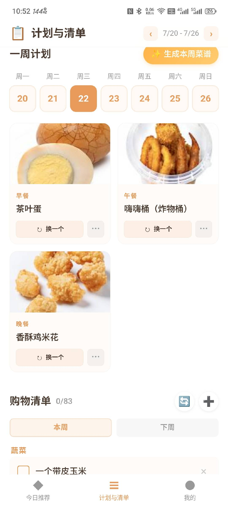
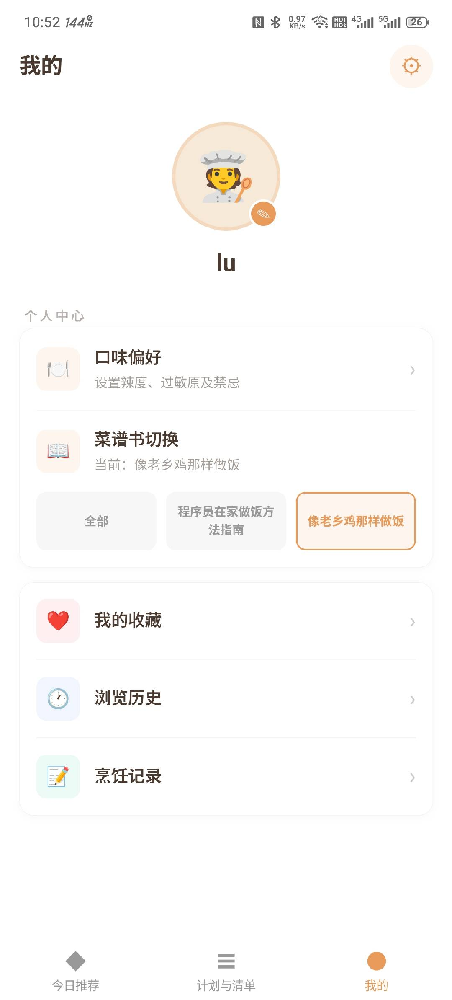

# 今天吃什么

“今天吃什么”是一款用于安排日常饮食的移动应用，围绕菜品推荐、菜谱查看、一周计划和购物清单组织主要功能。应用已发布 **v1.0.0**，可直接下载 Android 安装包体验。

::: tip 项目地址

- [查看 GitHub 仓库](https://github.com/Estrellahb/what_to_eat_today)
- [下载 Android v1.0.0](https://github.com/Estrellahb/what_to_eat_today/releases/tag/v1.0.0)

:::

## 项目功能

### 今日推荐

首页按早餐、午餐和晚餐展示推荐菜品，支持整组刷新和单个菜品更换。推荐结果可直接进入菜谱详情，也可以加入收藏。

### 菜谱详情

菜谱详情包含食材、制作步骤、小贴士和图片。完成制作后可以记录烹饪次数，常用菜谱可以加入收藏，方便后续查找。

### 一周计划

计划页面用于安排一周三餐，可以手动选择菜品，也可以随机生成本周计划。已有安排支持继续调整，减少每天临时决定餐食的时间。

### 购物清单

购物清单可以根据一周计划整理所需食材，也支持手动新增、删除和勾选已购买内容。计划与采购放在同一个页面中，查看时不需要来回切换。

### 个人记录

个人中心集中管理以下内容：

- 我的收藏
- 浏览历史
- 烹饪记录
- 菜谱书切换
- 口味偏好设置入口

### 菜谱数据源

应用支持切换不同菜谱书，当前菜谱数据整理自以下开源项目：

- [HowToCook](https://github.com/Anduin2017/HowToCook)
- [CookLikeHOC](https://github.com/Gar-b-age/CookLikeHOC)

## 项目展示

### 今日推荐



首页以卡片形式展示餐次和推荐菜品，并提供收藏、换一个和换一批操作。

### 计划与清单



一周计划按照星期展示每日餐食，下方购物清单用于汇总计划中的食材和记录采购状态。

### 个人中心



个人中心提供口味偏好、菜谱书切换、收藏、浏览历史和烹饪记录等入口。

## 技术实现

项目采用 **uni-app 和 Vue 3** 开发移动端界面，App 端使用 **SQLite** 保存菜谱及用户操作数据。Android 安装包通过 HBuilderX 与 Android Studio 完成本地打包。

项目主要目录包括：

```text
what_to_eat_today/
├── frontend/
│   ├── pages/          # 推荐、计划、个人中心、搜索和菜谱详情
│   ├── db/             # SQLite 数据操作
│   ├── static/json/    # 菜谱数据
│   ├── static/images/  # 菜品图片
│   └── App.vue         # 应用入口
└── README.md
```

## 下载与安装

当前公开版本为 **v1.0.0**，GitHub Release 中提供 Android APK 文件 `whateatstoday.v1.0.0.apk`。

1. 打开 [v1.0.0 发布页面](https://github.com/Estrellahb/what_to_eat_today/releases/tag/v1.0.0)。
2. 在 Assets 区域下载 APK 安装包。
3. 在 Android 设备上打开文件并完成安装。

::: warning 安装提示

Android 系统可能提示“允许安装未知来源应用”。该权限只需要对当前用于打开 APK 的浏览器或文件管理器临时授权。安装完成后可以关闭相关授权。

:::

## 开源项目

源代码、功能说明和后续更新记录均保存在 GitHub 仓库：

[https://github.com/Estrellahb/what_to_eat_today](https://github.com/Estrellahb/what_to_eat_today)
