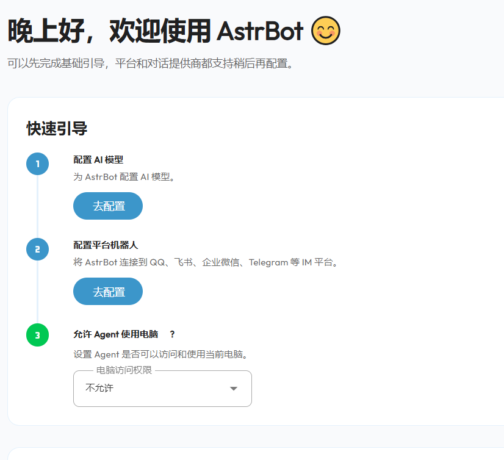
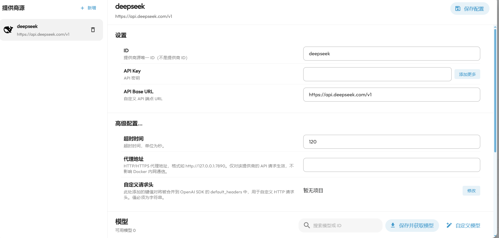

部署 AstrBot 需要准备一台服务器。在国内云服务商购买服务器时，域名接入国内服务器通常需要提前完成备案，这部分流程这里省略。

官方文档为：https://docs.astrbot.app/

## 使用 Docker Compose 部署

这里选择用 docker compose 部署。

```bash
mkdir astrbot
cd astrbot
wget https://raw.githubusercontent.com/NapNeko/NapCat-Docker/main/compose/astrbot.yml
sudo docker compose -f astrbot.yml up -d
```

这一步会拉取 AstrBot 相关容器并在后台启动。启动完成后，可以先查看容器状态：

```bash
sudo docker ps
```

如果容器没有正常启动，可以查看日志定位问题：

```bash
sudo docker logs -f astrbot
```

## 配置 Nginx 反向代理

这里使用了nginx进行反向代理，所以需要添加配置文件，代理astrbot接口6185。

创建配置文件：

```bash
sudo vim /etc/nginx/conf.d/astrbot.conf
```

写入：

```nginx
server {
    listen 80;
    server_name example.com;

    return 301 https://$host$request_uri;
}

server {
    listen 443 ssl http2;
    server_name example.com;

    ssl_certificate /etc/nginx/ssl/cloudflare-origin.crt;
    ssl_certificate_key /etc/nginx/ssl/cloudflare-origin.key;

    ssl_protocols TLSv1.2 TLSv1.3;

    location / {
        proxy_pass http://127.0.0.1:6185;

        proxy_http_version 1.1;
        proxy_set_header Host $host;
        proxy_set_header X-Real-IP $remote_addr;
        proxy_set_header X-Forwarded-For $proxy_add_x_forwarded_for;
        proxy_set_header X-Forwarded-Proto $scheme;

        proxy_set_header Upgrade $http_upgrade;
        proxy_set_header Connection "upgrade";
    }
}
```

记得把 server_name 改成自己的，这里使用了cloudflare管理dns和证书，所以配置文件写的多一点。

`proxy_pass http://127.0.0.1:6185;` 表示 Nginx 只在服务器内部访问 AstrBot 面板端口，公网访问入口仍然是 `80` 和 `443`。这样可以避免直接把 `6185` 暴露到公网。

## 检查 Nginx 配置

```bash
sudo nginx -t
```

如果显示：

```text
syntax is ok
test is successful
```

就重载 Nginx：

```bash
sudo systemctl reload nginx
```

如果检查失败，需要根据输出里的文件路径和行号修改配置。常见问题包括少写分号、证书路径不存在、`server_name` 没有填写实际域名。

## 云服务器安全组放行

需要放行：

```text
TCP 80
TCP 443
```

如果只通过 Nginx 访问，就**不需要对公网放行 6185**。

`6185` 是 AstrBot 面板服务端口，反向代理已经在本机内部转发到这个端口。安全组只开放 `80` 和 `443`，公网请求会先进入 Nginx，再由 Nginx 转发到本机的 AstrBot 服务。

## 获取初始用户名和密码

然后查询日志，获取用户名和密码。

```bash
sudo docker logs -f astrbot
```

找到：

```text
   ➜  Initial username: astrbot
   ➜  Initial password: ***
```

复制输入即可。

登录后建议先改下密码，避免继续使用初始密码。

进入到astrbot控制台：



## 配置大模型

先配置大模型，以deepseek为例。

https://www.deepseek.com/

（便宜好用

充好钱后 在api keys页面中 点击创建apikey，编写一个名称 以astrbot为例，随后复制这个密钥回到astrbot的控制台点击配置ai模型，在提供商里选择deepseek，把apikey复制进去。



随后在下方 模型中 点击保存并获取模型，勾选flash 和 pro模型，即可开始对话了。

API Key 属于敏感信息，保存后不要截图公开完整密钥。若需要发布配置截图，建议提前打码。