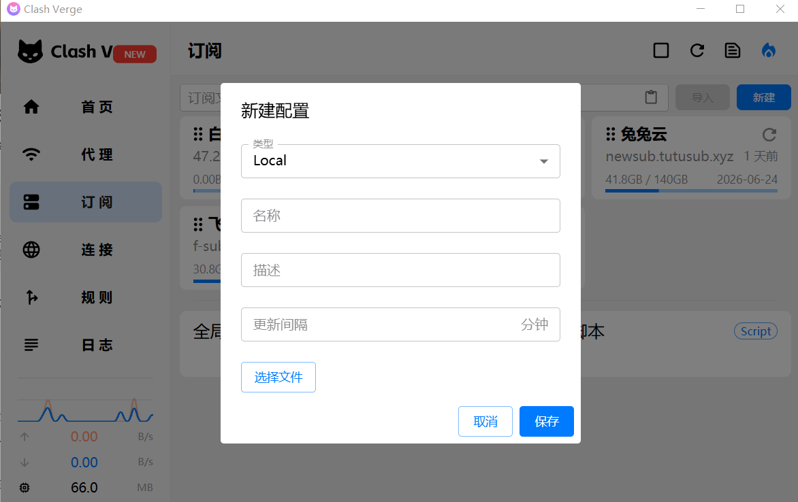

首先需要一台国外的vps

https://vpscost.com/blog/post/%E5%A6%82%E4%BD%95%E9%85%8D%E7%BD%AE_clash_verge_%E6%9C%8D%E5%8A%A1%E7%AB%AF

我的环境是Ubuntu 22.04

```bash
# 1. 更新系统软件包
sudo apt update
sudo apt -y upgrade

# 2. 安装 Docker 官方源依赖
sudo apt -y install ca-certificates curl gnupg

# 3. 添加 Docker 官方 GPG key
sudo install -m 0755 -d /etc/apt/keyrings

curl -fsSL https://download.docker.com/linux/ubuntu/gpg | \
sudo gpg --dearmor -o /etc/apt/keyrings/docker.gpg

sudo chmod a+r /etc/apt/keyrings/docker.gpg

# 4. 添加 Docker 官方软件源
echo \
"deb [arch=$(dpkg --print-architecture) signed-by=/etc/apt/keyrings/docker.gpg] https://download.docker.com/linux/ubuntu \
$(. /etc/os-release && echo "$VERSION_CODENAME") stable" | \
sudo tee /etc/apt/sources.list.d/docker.list > /dev/null

# 5. 安装 Docker 和 Docker Compose 插件
sudo apt update
sudo apt -y install docker-ce docker-ce-cli containerd.io docker-buildx-plugin docker-compose-plugin

# 6. 启动并设置 Docker 开机自启
sudo systemctl enable --now docker
```

检查 Docker：

```bash
docker --version
docker compose versionsudo
systemctl status docker
```

## 安装BBR

引用链接: [# 什么是 BBR？](https://www.linuxv2ray.com/kb/what-is-bbr/)

>BBR 是 Bottleneck Bandwidth and RTT 的简称，是谷歌在2016年推出的全新的网络拥塞控制算法，是一种加速网络传输协议 TCP 的新算法，这种算法通过优化传输速度，避免路由堵塞现象的产生。BBR 利用瓶颈带宽和往返传播时间，被认为是迄今为止跨越不同路由发送数据的最快方法，当数据路由拥挤时，能够更有效地处理流量。

## 开启BBR

引用链接 ：[开启 BBR 加速](https://www.linuxv2ray.com/speedup/google-tcp-bbr-one-click-script-for-v2ray/)

使用 root 账户执行以下命令修改系统变量

```bash
echo 'net.core.default_qdisc=fq' | sudo tee -a /etc/sysctl.conf
echo 'net.ipv4.tcp_congestion_control=bbr' | sudo tee -a /etc/sysctl.conf
sysctl -p
```

完成后，执行以下命令：

```bash
sysctl net.ipv4.tcp_available_congestion_control
```

输出应为 `net.ipv4.tcp_available_congestion_control = bbr cubic reno`
最后执行以下命令以检测 BBR 是否开启

```bash
lsmod | grep bbr
```

如果输出里有：

```text
tcp_bbr                20480  18
```

就说明 BBR 已启用。

## 安装sing - box服务端

https证书我使用的是certbot来配置
检查 certbot 证书目录名：

```bash
sudo ls -l /etc/letsencrypt/live/
```

### 创建文件

```bash
sudo mkdir -p /data/sb-hy2
cd /data/sb-hy2
sudo vim docker-compose.yml
sudo vim config.json
```

#### config.json

```json
{
  "log": {
    "level": "info"
  },
  "inbounds": [
    {
      "type": "hysteria2",
      "listen": "0.0.0.0",
      "listen_port": 443,
      "users": [
        {
          "name": "user001",
          "password": "CHANGE_ME_BASE64_24"
        }
      ],
      "tls": {
        "enabled": true,
        "certificate_path": "/etc/letsencrypt/live/proxy.example.com/fullchain.pem",
        "key_path": "/etc/letsencrypt/live/proxy.example.com/privkey.pem"
      }
    }
  ],
  "outbounds": [
    {
      "type": "direct"
    }
  ]
}
```

#### docker-compose.yml

```yaml
services:
  singbox:
    image: ghcr.io/sagernet/sing-box:latest
    container_name: singbox-hy2
    restart: unless-stopped
    network_mode: host
    command: ["run", "-c", "/etc/sing-box/config.json"]
    volumes:
      - /data/sb-hy2/config.json:/etc/sing-box/config.json:ro
      - /etc/letsencrypt:/etc/letsencrypt:ro
```

**启动 Sing-Box**：
使用以下命令启动 **Sing-Box** 服务端：

```bash
cd /data/sb-hy2
sudo docker compose up -d
```

检查服务是否成功启动

```text
sudo docker logs -f singbox-hy2

#输出以下内容为成功
INFO[0000] network: updated default interface eth0, index 2
INFO[0000] inbound/hysteria2[0]: udp server started at 0.0.0.0:443
INFO[0000] sing-box started (0.00s)
```

## 配置 Clash Verge 客户端

1. **下载和安装 Clash Verge**：
    在客户端设备上下载 **Clash Verge** 客户端，并根据需求进行安装。

2. **配置节点**：
    在 **Clash Verge** 中配置你刚才在 Sing-Box 中设置的代理服务器信息。确保配置项正确，生成强力密码：`openssl rand -base64 24` 并按照以下格式设置：

```yaml
port: 7890
socks-port: 7891
allow-lan: true
mode: rule
log-level: info

proxies:
  - name: hy2-proxy.example.com
    type: hysteria2
    server: proxy.example.com
    port: 443
    password: CHANGE_ME_BASE64_24
    sni: proxy.example.com
    alpn:
      - h3
    skip-cert-verify: false

proxy-groups:
  - name: 🚀 Proxy
    type: select
    proxies:
      - hy2-proxy.example.com
      - DIRECT

rules:
  - GEOIP,CN,DIRECT
  - MATCH,🚀 Proxy
```

把上面的配置文件保存为 xxx.yaml；
注意：password要和config保持一致

导入配置



## 通过url方式导入订阅文件

### 1. 创建 Clash 订阅文件目录

在服务器执行：

```bash
sudo mkdir -p /var/www/clash-sub
```

创建 Clash 配置文件：

```bash
sudo nano /var/www/clash-sub/example-hy2.yaml
```

粘贴下面内容：

```yaml
port: 7890
socks-port: 7891
allow-lan: true
mode: rule
log-level: info

proxies:
  - name: hy2-proxy.example.com
    type: hysteria2
    server: proxy.example.com
    port: 443
    password: CHANGE_ME_BASE64_24
    sni: proxy.example.com
    alpn:
      - h3
    skip-cert-verify: false

proxy-groups:
  - name: 🚀 Proxy
    type: select
    proxies:
      - hy2-proxy.example.com
      - DIRECT

rules:
  - IP-CIDR,192.168.0.0/16,DIRECT
  - IP-CIDR,10.0.0.0/8,DIRECT
  - IP-CIDR,172.16.0.0/12,DIRECT
  - GEOIP,CN,DIRECT
  - MATCH,🚀 Proxy
```

保存后设置权限：

```bash
sudo chmod 644 /var/www/clash-sub/example-hy2.yaml
```

### 编辑 Nginx 站点配置文件

```bash
sudo vim /etc/nginx/conf.d/proxy.example.com.conf
```

```nginx
server{
    listen 443 ssl http2
    ...
    # 写在这里
    location = /sub/example-hy2.yaml {
        alias /var/www/clash-sub/example-hy2.yaml;
        default_type application/yaml;

        add_header Content-Disposition 'attachment; filename="example-hy2.yaml"';
        add_header profile-update-interval 24;
    }

}
```

检查并重载

```bash
sudo nginx -t
sudo systemctl reload nginx
```

测试配置文件

```bash
curl -I https://proxy.example.com/sub/example-hy2.yaml

response: HTTP/2 200
```

然后复制 `https://proxy.example.com/sub/example-hy2.yaml` 即可导入到chash中

## 多用户配置(目前)

编辑服务端配置

```bash
sudo vim /data/sb-hy2/config.json
```

把 `users` 改成多个用户，例如：

```json
{
  "log": {
    "level": "info"
  },
  "inbounds": [
    {
      "type": "hysteria2",
      "listen": "0.0.0.0",
      "listen_port": 443,
      "users": [
        {
          "name": "user001",
          "password": "CHANGE_ME_BASE64_24_USER001"
        },
        {
          "name": "user002",
          "password": "CHANGE_ME_BASE64_24_USER002"
        },
        {
          "name": "user003",
          "password": "CHANGE_ME_BASE64_24_USER003"
        }
      ],
      "tls": {
        "enabled": true,
        "certificate_path": "/etc/letsencrypt/live/proxy.example.com/fullchain.pem",
        "key_path": "/etc/letsencrypt/live/proxy.example.com/privkey.pem"
      }
    }
  ],
  "outbounds": [
    {
      "type": "direct"
    }
  ]
}
```

```nginx
location ^~ /sub/ {
alias /var/www/clash-sub/;
default_type application/yaml;

add_header Content-Disposition 'attachment';
add_header profile-update-interval 24;

autoindex off;
}
```

`^~` 匹配 /sub/ 下所有文件
