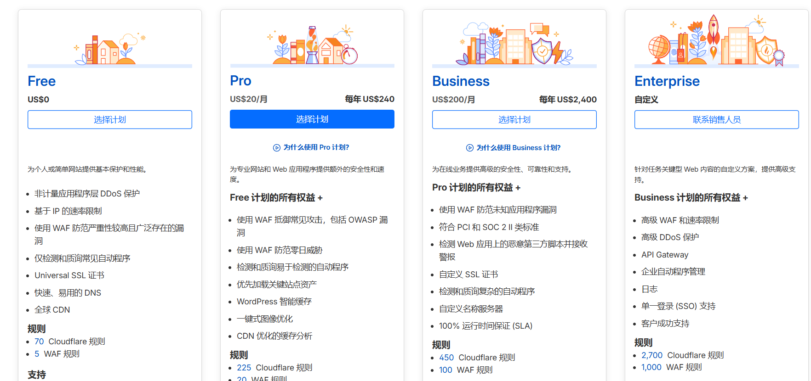
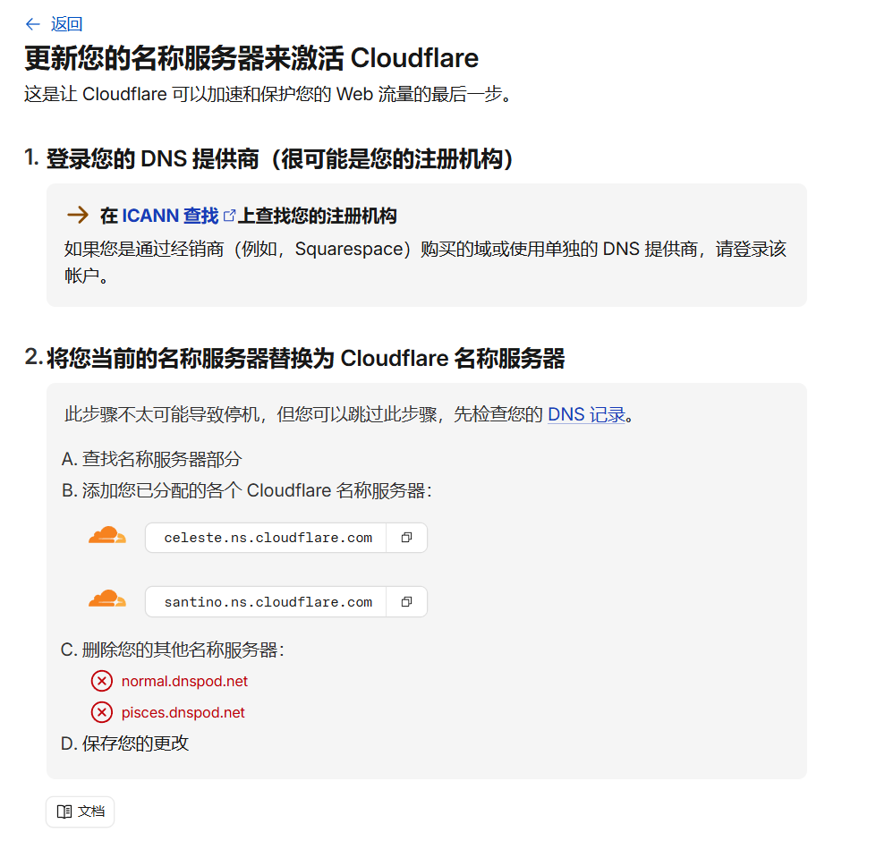
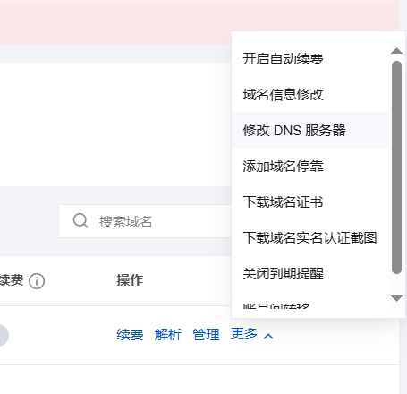
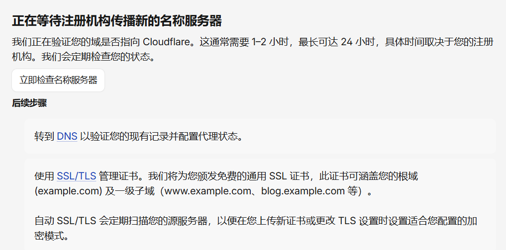

# 把腾讯云服务器上的域名接入 Cloudflare

网站第一次跑起来的时候，最容易让人误判的一件事，是“能打开”不等于“已经接好了”。

买完腾讯云服务器，装好环境，域名也解析到了公网 IP，页面确实能访问。但这时候的网站通常还是裸站。域名直接打到源站，HTTPS、边缘缓存、基础防护、入口层规则，都还很原始。

这也是很多个人站后面会补的一层东西：**站点接入层**。再说具体一点，就是 **边缘代理与安全防护层**。它不负责写你的业务，也不替你部署应用，但它会站在访客和源站之间，帮你处理接入、加密、缓存和一部分安全问题。

Cloudflare 免费版常被拿来做这件事，不是因为它“神”，而是因为它刚好把这几件基础能力打包在了一起。

## 问题背景

如果你现在的状态和我差不多，流程大概是这样的：

- 买了一台腾讯云服务器。
- 买了一个域名。
- 在服务器上把网站跑起来了。
- 在腾讯云或 DNSPod 里把域名解析到了服务器。

到这一步，网站已经能打开，但还缺一层像样的入口。

少了这层之后，常见情况会变成：

- 源站 IP 直接暴露。
- HTTPS 要自己一点点补。
- 想做缓存、跳转、强制 HTTPS，要么继续堆 Nginx，要么到处分散配置。
- 碰到异常流量时，前面没有缓冲层。

所以这里真正的问题，不是“域名能不能解析”，而是：**个人网站在第一次上线之后，要不要补一层边缘代理与安全防护层。**

## 腾讯云和 Cloudflare 免费版怎么选

这两边不要硬比成同一种产品。更准确的说法是，它们解决的问题范围不一样。

### 腾讯云默认免费方案的优点

对大多数个人站来说，腾讯云这边最常用的是 DNSPod 免费解析。它的事情很明确，就是把域名托管好，让解析记录正常工作。

它的优点是：

- 基础解析已经够用，A、AAAA、CNAME、MX、TXT 这些常见记录都能配。
- 只想把域名指向服务器的人，上手成本很低。
- 如果你的目标只是“网站能打开”，它已经完成任务了。

换句话说，腾讯云默认免费方案更像“把域名接好”。

### Cloudflare 免费版的优点

Cloudflare 免费版的重点不只是 DNS，而是接管站点入口层的一部分能力。

它比较有吸引力的地方在这里：

- **反向代理**：主站流量可以先经过 Cloudflare，再回源到腾讯云服务器。
- **边缘 HTTPS**：免费提供 Universal SSL，浏览器到 Cloudflare 这一段 HTTPS 很容易先跑起来。
- **基础安全能力**：有基础托管规则集，可以先挡掉一部分低质量请求。
- **缓存和规则**：后面做缓存、重定向、强制 HTTPS，会顺手很多。
- **减少直接暴露源站**：访客面对的是边缘节点，不是源站直接裸露在外。

如果你要的是一层更完整的站点接入层，Cloudflare 免费版明显比“只有免费解析”更完整。

### Cloudflare 免费版的代价

它也不是没有代价。

- 如果访问者主要在中国大陆，Cloudflare 免费版不一定更快。
- 接入层多了一跳，排障会比“域名直打服务器”复杂。
- 如果 DNS 记录迁移不完整，邮箱、验证记录、子域名服务都可能出问题。

所以我更愿意把结论写成这样：

- 只要基础解析，腾讯云默认免费方案够用。
- 想补一层边缘代理与安全防护层，Cloudflare 免费版更合适。

## 接入前准备

正式改 nameserver 之前，先把这些准备好。

- 一台已经能正常访问的腾讯云服务器。
- 一个已经注册好的域名。
- 腾讯云域名控制台登录权限。
- 一个 Cloudflare 账号。
- 当前全部 DNS 记录的备份。

这里最重要的是 DNS 记录备份。不要只记主站记录，下面这些都要一起看：

- `@` 主站记录。
- `www` 记录。
- 邮箱相关的 `MX` 记录。
- 各种 `TXT` 验证记录。
- 你自己在用的其他子域名。

我建议在切换前做两件事：

1. 把当前 DNS 记录页面完整截图。
2. 手工整理一份最小表格，至少记下主机记录、类型、记录值、用途。

如果你现在连源站都还没跑顺，先别切 Cloudflare。先把 Nginx、站点访问、证书这些基础问题跑通，再接这一层，会轻松很多。

## 详细步骤

下面这套流程，适合“域名原本在腾讯云这边解析，现在准备切到 Cloudflare 托管”的场景。

### 1. 在 Cloudflare 添加站点

登录 [Cloudflare](https://www.cloudflare.com/zh-cn/) 后，点击 `Add a site`，选择 `连接域名` 输入你的域名，选择 `Free` 计划。

Cloudflare 会先扫描你当前域名已有的 DNS 记录。这一步先别急着点下一步，后面要认真核对。

### 2. 检查 Cloudflare 扫描出来的 DNS 记录

这一页很关键。Cloudflare 扫描得再快，也不代表它一定完整。

你至少要核对这些内容：

- 主站 `@` 的 `A` 记录，是否正确指向腾讯云服务器公网 IP。
- `www` 记录是否正确。
- 邮箱相关的 `MX` 记录有没有漏。
- 各种 `TXT` 验证记录有没有漏。
- 你自己用到的子域名有没有漏。

如果有缺失，就在这里手工补上。

> 配图建议：Cloudflare DNS 记录页。

### 记录类型顺手解释一下

第一次看到 Cloudflare 的记录类型下拉框，容易被一长串选项吓到。其实个人网站常改的通常只有几种：

- `A`：把域名指向 IPv4 地址，最常用。
- `AAAA`：把域名指向 IPv6 地址，没有 IPv6 可以先不管。
- `CNAME`：把一个域名指向另一个域名，`www` 很常见。
- `MX`：邮箱记录，通常不走代理。
- `TXT`：验证和邮箱相关配置常用。

像 `CAA`、`DS`、`DNSKEY`、`HTTPS`、`CERT` 这些类型，普通个人站前期基本不会手动改，不确定就先别动。

### 3. 决定哪些记录开代理，哪些保持 DNS only

通常可以这样处理：

- 主站 `@`：`Proxied`
- `www`：`Proxied`
- 邮箱相关记录：`DNS only`
- 验证类 `TXT` 记录：保持原样
- 其他特殊服务子域名：逐条判断

不要把所有记录都开成橙云。邮件、验证、某些服务子域名，本来就不该走代理。

因为我只想让主站入口先经过 Cloudflare。其他不是直接给访客访问的记录，没必要一起走代理。

### 4. 去腾讯云修改域名的 nameserver

点击 `继续前往激活` 后，cloudflare 提示你去 DNS 提供商，替换为 Cloudflare 名称服务器

进入[腾讯云域名控制台](https://console.cloud.tencent.com/domain/all-domain/all)，在 我的域名 中选择你注册的域名，点击最右侧的箭头-修改dns服务器

把域名的 DNS 服务器改成 Cloudflare 分配给你的两条 nameserver。

### 5. 等待 Cloudflare 激活

Cloudflare 识别到 nameserver 已经切过来之后，站点会变成激活状态。

如果迟迟没有激活，优先检查这几件事：

- 两条 nameserver 有没有填错。
- 腾讯云控制台是否真的提交成功。
- 这个域名当前注册商是不是腾讯云。

## 参考资料

- Cloudflare 主 DNS 接入：<https://developers.cloudflare.com/dns/zone-setups/full-setup/>
- Cloudflare 修改 nameserver：<https://developers.cloudflare.com/dns/zone-setups/full-setup/setup/>
- Cloudflare Proxy 状态说明：<https://developers.cloudflare.com/dns/proxy-status/>
- Cloudflare Universal SSL：<https://developers.cloudflare.com/ssl/edge-certificates/universal-ssl/>
- Cloudflare Full (strict)：<https://developers.cloudflare.com/ssl/origin-configuration/ssl-modes/full-strict/>
- Cloudflare Always Use HTTPS：<https://developers.cloudflare.com/ssl/edge-certificates/additional-options/always-use-https/>
- Cloudflare Origin CA：<https://developers.cloudflare.com/ssl/origin-configuration/origin-ca/>
- 腾讯云修改 DNS 服务器：<https://cloud.tencent.com/document/product/242/62106>
- 腾讯云云解析 DNS：<https://cloud.tencent.com/product/dns>
- 腾讯云 CDN：<https://cloud.tencent.com/product/cdn>
- 腾讯云 EdgeOne：<https://cloud.tencent.com/product/teo>
- 腾讯云免费 SSL 证书概述：<https://cloud.tencent.com/document/product/400/89868>
